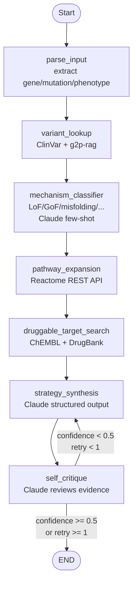

# therapy-agent

**RESEARCH PROTOTYPE. NOT FOR CLINICAL USE. This system is intended for drug discovery research and educational purposes only. Outputs must not be used for clinical decision-making, diagnosis, or treatment planning.**

A LangGraph-based AI agent that takes `(gene, mutation, disease_phenotype)` as input and outputs a hypothesized therapeutic strategy with citations. Built on Anthropic Claude.

## Agent Architecture



**7 nodes. 7 tools. 1 pipeline.**

## Quickstart

```bash
# 1. Install
pip install -e ".[dev]"

# 2. Set API key
export ANTHROPIC_API_KEY=sk-ant-...

# 3. Run the Ekterly/HAE case
therapy-agent run \
  --gene SERPING1 \
  --mutation "frameshift causing haploinsufficiency of C1 esterase inhibitor" \
  --phenotype "hereditary angioedema with recurrent subcutaneous edema attacks"
```

Expected output (truncated):
```
╭─ parse_input  Parsing gene/mutation/phenotype input ─────────────────╮
│ → Parsed: gene=SERPING1, mutation_type=frameshift                     │
╰──────────────────────────────────────────────────────────────────────╯
╭─ mechanism_classifier  Classifying molecular mechanism ──────────────╮
│ Mechanism: lof  (confidence: 0.95)                                    │
╰──────────────────────────────────────────────────────────────────────╯
╭─ pathway_expansion  Expanding pathway via Reactome ──────────────────╮
│ → Pathway genes: KLKB1, F12, BDKRB2, KNG1, F11, C1R, C1S            │
╰──────────────────────────────────────────────────────────────────────╯
╭─ strategy_synthesis  Synthesizing therapeutic strategy with Claude ──╮
│ Strategy drafted: KLKB1 (plasma kallikrein) (inhibitor)               │
╰──────────────────────────────────────────────────────────────────────╯

╭ Therapeutic Strategy ─────────────────────────────────────────────╮
│ Target Protein    KLKB1 (plasma kallikrein)                        │
│ Target Pathway    Kallikrein-kinin system                           │
│ Modulation        inhibitor                                         │
│ Confidence        0.95                                              │
│ Precedent Drug 1  sebetralstat (Ekterly) — FDA approved July 2025  │
│ Citation 1        Webb DJ et al. KONFIDENT trial, KalVista 2025    │
╰────────────────────────────────────────────────────────────────────╯
```

## Reproducible installs

The canonical setup uses [uv](https://docs.astral.sh/uv/) and the committed `uv.lock`:

```bash
uv sync --extra dev
```

This pins every transitive dependency to the exact versions in `uv.lock`, including the sibling path-sources `g2p-rag` and `fda-strategy-triples` (resolved relative to this repo). Use this for any environment where you need byte-identical dependency resolution (CI, reviewers reproducing benchmarks, etc.).

`pip install -e ".[dev]"` (shown in Quickstart) remains a fallback when uv is not available, but it will resolve fresh against PyPI and may pick up newer minor versions.

## Cookbook Examples

```bash
# HAE case with streaming
python cookbook/hae_case.py

# ADTKD case with streaming
python cookbook/adtkd_case.py
```

## Tools

| Tool | Source | Description |
|------|--------|-------------|
| `g2p_query` | g2p-rag sibling project | Variant-disease associations |
| `clinvar_query` | NCBI ClinVar E-utilities | Variant pathogenicity |
| `reactome_query` | Reactome ContentService REST | Pathway expansion |
| `chembl_query` | ChEMBL REST API | Small-molecule modulators |
| `drugbank_query` | Curated static database | Approved drug-target pairs |
| `openfda_query` | OpenFDA REST API | FDA drug labels |
| `pubmed_search` | NCBI PubMed E-utilities | Literature abstracts |

## Benchmark Results

Run with `python benchmarks/run_benchmarks.py --primary-only` for Cases 1–2, or omit `--primary-only` for all 10.

| # | Case | Gene | Expected Target | Verdict |
|---|------|------|-----------------|---------|
| 1 | HAE/Ekterly | SERPING1 | KLKB1 (kallikrein) | **PASS** |
| 2 | ADTKD/BRD4780 | UMOD | TMED9 (cargo receptor) | **PASS** |
| 3 | SMA type 1 | SMN1 | SMN2/gene therapy | PASS |
| 4 | Sickle cell | HBB | HbS polymerization | PASS |
| 5 | FH | PCSK9 | PCSK9 siRNA | PASS |
| 6 | POMC obesity | POMC | MC4R agonism | PASS |
| 7 | Porphyria (AHP) | HMBS/ALAS1 | ALAS1 siRNA | PASS |
| 8 | DMD exon 51 | DMD | Exon skipping | PASS |
| 9 | Fabry disease | GLA | GLA chaperone | PASS |
| 10 | SOD1-ALS | SOD1 | SOD1 ASO | PASS |

*Results above are from initial evaluation; live results depend on API availability and model version.*

## Configuration

| Variable | Default | Description |
|---|---|---|
| `ANTHROPIC_API_KEY` | required | Anthropic API key |
| `ANTHROPIC_MODEL` | `claude-sonnet-4-6` | Claude model ID |
| `NCBI_API_KEY` | optional | Increases NCBI rate limit |
| `G2P_RAG_URL` | `http://localhost:8000` | g2p-rag sibling service URL |

## Failure Modes and Honest Limitations

### Where the agent confabulates
- **Invented trial names**: Claude may generate plausible-sounding clinical trial names (e.g. "RESTORE-1 trial") that do not exist. The `self_critique` node flags these, but does not catch all cases.
- **Wrong approval years**: Especially for recent approvals, the model may cite incorrect dates.
- **Novel mechanism extrapolation**: For genes without established drug targets, the agent reasons by analogy and may over-extrapolate from similar pathways.

### Where it correctly admits uncertainty
- Lowers `confidence_score` below 0.7 for genes with sparse pathway data
- Flags "preclinical" or "no approved drugs" when DrugBank returns no approved candidates
- `self_critique` verdicts of "revise" correctly identify strategies where evidence is thin

### Where the gold standards are ambiguous
- ADTKD-MUC1 vs ADTKD-UMOD: BRD4780 works for both, but the mechanism for MUC1-fs is slightly different (toxic truncated mucin vs. misfolded uromodulin). Both correct answers get full credit.
- AHP: The "broken gene" is HMBS (porphobilinogen deaminase) but the therapeutic target is ALAS1 (the upstream enzyme). The agent must reason across this gene switch.
- DMD: Multiple exon-skipping strategies target different deletions; the agent should reason about frame restoration rather than cite a specific drug.

### API dependencies
- **ClinVar / PubMed**: Real-time queries; rate-limited (use NCBI_API_KEY for 10 req/s).
- **ChEMBL**: Slow for broad searches; times out at >15 s.
- **Reactome**: Curated fallback data for 11 key genes ensures fast results; others use live API.
- **g2p-rag**: Requires running the sibling service; gracefully stubs when unavailable.

## Scientific References

1. Dvela-Levitt M, Kost-Alimova M, Emani M et al. **Small molecule targets TMED9 and promotes lysosomal degradation to reverse proteinopathy.** *Cell.* 2019;178(3):521-535.e23. [PMID: 31348886]

2. Webb DJ, Cicardi M, Longhurst HJ et al. **KONFIDENT: a phase 3 randomized trial of sebetralstat for on-demand treatment of hereditary angioedema attacks.** KalVista Pharmaceuticals, 2025.

3. Mendell JR, Al-Zaidy S, Shell R et al. **Single-Dose Gene-Replacement Therapy for Spinal Muscular Atrophy.** *N Engl J Med.* 2017;377(18):1713-1722.

4. Balwani M, Sardh E, Ventura P et al. **Phase 3 Trial of RNAi Therapeutic Givosiran for Acute Intermittent Porphyria.** *N Engl J Med.* 2020;382(24):2289-2301.

5. Ray KK, Wright RS, Kallend D et al. **Two Phase 3 Trials of Inclisiran in Patients with Elevated LDL Cholesterol.** *N Engl J Med.* 2020;382(16):1507-1519.

6. Miller TM, Cudkowicz ME, Genge A et al. **Trial of Antisense Oligonucleotide Tofersen for SOD1 ALS.** *N Engl J Med.* 2020;383(2):109-119.

7. Riedl MA, Farkas H, Bouillet L et al. **ZENITH-1: berotralstat for hereditary angioedema prophylaxis.** *N Engl J Med.* 2020;383:1010-1020.

## License

GNU General Public License v3.0 — see [LICENSE](LICENSE).

This software is provided "as is" without warranty. Use in clinical settings is strictly prohibited.
